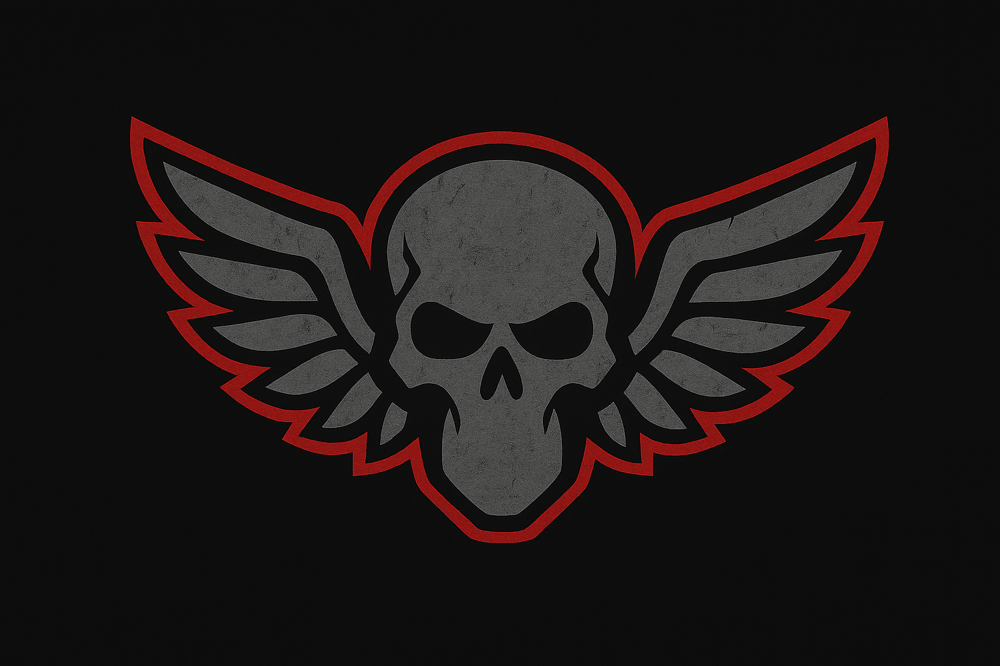

<div align="center">

# ORCUS

### Autonomous Multi-Drone Kamikaze System



[](https://www.python.org/)
[](https://www.ros.org/)
[](https://ardupilot.org/)
[](http://gazebosim.org/)
[](https://github.com/ultralytics/ultralytics)
[](https://opencv.org/)
[](https://flask.palletsprojects.com/)
[](https://dronekit.io/)
[](https://www.docker.com/)
[](https://www.linux.org/)
[](LICENSE)

---

[🇬🇧 English](#english) | [🇹🇷 Türkçe](#turkish)

---

</div>

<a name="english"></a>
## 🇬🇧 English

### 📖 About the Project

**ORCUS** is an advanced autonomous multi-drone system designed for intelligent area scanning and target engagement. Named after the Roman god of death, this system coordinates multiple drones to independently search designated areas, detect human targets using AI-powered computer vision, and execute precision collision missions.

**Key Features:**
- 🎯 **Multi-Drone Coordination**: Intelligent grid partitioning prevents collision between drones
- 🤖 **AI-Powered Detection**: YOLOv8-based real-time human detection and tracking
- 🔄 **Independent Operation**: Each drone operates autonomously with its own camera feed
- 📡 **Real-Time Monitoring**: Web-based interface for mission control and live video streaming
- 🎮 **Smart Targeting**: PID-based tracking with body frame velocity control
- 🗺️ **Boustrophedon Pattern**: Efficient area coverage using zigzag scanning

### 🛠️ Technology Stack

- **Flight Controller**: ArduPilot SITL
- **Simulation**: Gazebo with ROS integration
- **AI/ML**: YOLOv8 (Ultralytics) for object detection
- **Communication**: DroneKit, MAVLink protocol
- **Backend**: Flask web server
- **Frontend**: Real-time video streaming with MJPEG

---

### 🚀 Installation & Setup

#### Prerequisites
- Ubuntu 20.04
- Python 3.8+
- ROS Noetic

#### Step 1: Setup Simulation Environment

First, follow the complete setup instructions in our Docker-based simulation repository:

🔗 **[ArduGazeboSim-Docker Repository](https://github.com/koesan/ArduGazeboSim-Docker)**

**Complete all steps in that repository before proceeding!** This includes:
- Docker installation
- ROS package setup
- ArduPilot SITL installation
- Gazebo simulation environment

#### Step 2: Clone ORCUS Project

After successfully setting up the simulation environment, navigate to your ArduGazeboSim directory and clone ORCUS:
```bash
# You should be in ArduGazeboSim directory after completing Step 1
cd ArduGazeboSim

# Clone ORCUS into this directory
git clone https://github.com/koesan/ORCUS.git
```

#### Step 3: Configure Drone Models & World (Recommended - For Camera Support)

Replace the default simulation files with camera-enabled versions:

```bash
# Make sure you are in ArduGazeboSim directory
# Copy drone models (replace old ones)
cp -r ORCUS/simulator/drone/drone1/* catkin_ws/src/iq_sim/models/drone1/
cp -r ORCUS/simulator/drone/drone2/* catkin_ws/src/iq_sim/models/drone2/

# Copy world file (replace old one)
cp ORCUS/simulator/worlds/multi_drone.world catkin_ws/src/iq_sim/worlds/
```

**📝 What This Does:**

This step adds **forward-facing RGB cameras** to the default drone models and includes **2 human actor models** in the simulation world. Since default drones don't have cameras, this upgrade is essential for ORCUS to perform human detection and real-time video streaming. The world file also includes pre-configured lighting and environment for optimal camera performance.

**⚠️ Important:** Paths are relative to `ArduGazeboSim` directory. Run these commands while inside that folder. Old files will be replaced (backup if needed).

---

### 🎮 Running the System

#### Terminal 1: Launch Simulation
```bash
roslaunch iq_sim multi_drone.launch
```
Wait for Gazebo to fully load.

#### Terminal 2: Connect Drone 1
```bash
sim_vehicle.py -v ArduCopter -f gazebo-iris -I0
```

#### Terminal 3: Connect Drone 2
```bash
sim_vehicle.py -v ArduCopter -f gazebo-iris -I1
```

#### Terminal 4: Start ORCUS Control System

**⚠️ Important**: This must be run **inside the Docker container** (if using Docker setup).

```bash
# Navigate to ORCUS directory
cd ArduGazeboSim/ORCUS

# Install Python dependencies (first time only)
pip3 install -r requirements.txt

# Run the application
python3 app.py
```

**Note**: If you're using the Docker setup from ArduGazeboSim-Docker, make sure you're inside the container when running these commands.

#### Step 5: Access Web Interface

Open your browser and navigate to:
```
http://localhost:5000/
```

---

### 📋 Mission Workflow

1. **Connect Drones**: Enter connection strings (tcp:127.0.0.1:5760, tcp:127.0.0.1:5761)
2. **Define Area**: Click on map to set search area boundaries
3. **Start Mission**: System automatically partitions area between drones
4. **Autonomous Scanning**: Each drone scans its assigned grid independently
5. **Target Detection**: When human detected, drone switches to tracking mode
6. **Collision Execution**: Drone locks onto target and executes collision mission
7. **Independent Operation**: Other drones continue their own missions

---

### 🏗️ System Architecture

```
ORCUS/
├── app.py                          # Main Flask application
├── config.py                       # System configuration
├── modules/
│   ├── drone_manager.py           # Multi-drone coordination
│   ├── collision_mission_controller.py  # Mission control logic
│   ├── human_tracker.py           # YOLOv8 tracking module
│   └── camera_ai.py               # ROS camera handler
├── models/
│   └── yolov8n.pt                 # YOLO model
├── templates/
│   └── index.html                 # Web interface
└── simulator/                      # Gazebo models & worlds
```

---

### 📊 Area Partitioning Algorithm

ORCUS uses intelligent horizontal partitioning:

```
Total Area (16 cells):
┌──┬──┬──┬──┐
│ 1│ 2│ 3│ 4│  → Row 0
├──┼──┼──┼──┤
│ 5│ 6│ 7│ 8│  → Row 1  } Drone 1 (Port 5760)
├──┼──┼──┼──┤  ═══════════════════════
│ 9│10│11│12│  → Row 2
├──┼──┼──┼──┤
│13│14│15│16│  → Row 3  } Drone 2 (Port 5761)
└──┴──┴──┴──┘

Each drone scans using boustrophedon (zigzag) pattern:
Drone 1: 1→2→3→4, 8←7←6←5
Drone 2: 9→10→11→12, 16←15←14←13
```

**Benefits:**
- ✅ No collision risk (different rows)
- ✅ Equal workload distribution
- ✅ Independent operation
- ✅ Efficient coverage

---

### ⚙️ Configuration

Key parameters in `config.py`:

```python
# Drone Settings
TAKEOFF_ALTITUDE = 5                    # meters
DRONE_SPEED = 90                        # cm/s

# Collision Mission
COLLISION_FORWARD_SPEED = 2.0           # m/s
COLLISION_SCREEN_THRESHOLD = 0.40       # 40% screen coverage triggers collision
HUMAN_LOST_TIMEOUT = 5.0                # seconds

# AI Detection
YOLO_CONF_THRESHOLD = 0.25              # Detection confidence threshold
YOLO_TRACKING_ENABLED = True            # Enable track persistence
```

---

### 📄 License

This project is licensed under the Apache License 2.0 - see the [LICENSE](LICENSE) file for details.

---

### ⚠️ Disclaimer

This project is for **educational and research purposes only**. The developers are not responsible for any misuse of this system. Always comply with local laws and regulations regarding drone operations.

---

<a name="turkish"></a>
## 🇹🇷 Türkçe

### 📖 Proje Hakkında

**ORCUS**, akıllı alan taraması ve hedef kilitlenmesi için tasarlanmış gelişmiş bir otonom çoklu drone sistemidir. Roma ölüm tanrısı Orcus'tan ismini alan bu sistem, birden fazla drone'u koordine ederek belirlenmiş alanları bağımsız olarak tarar, yapay zeka destekli bilgisayarlı görü ile insan hedeflerini tespit eder ve hassas çarpma görevi gerçekleştirir.

**Temel Özellikler:**
- 🎯 **Çoklu Drone Koordinasyonu**: Akıllı grid bölümleme ile drone'lar arası çarpışma önleme
- 🤖 **Yapay Zeka Destekli Tespit**: YOLOv8 tabanlı gerçek zamanlı insan tespit ve takip
- 🔄 **Bağımsız Çalışma**: Her drone kendi kamera beslemesi ile özerk çalışır
- 📡 **Gerçek Zamanlı İzleme**: Görev kontrolü ve canlı video akışı için web tabanlı arayüz
- 🎮 **Akıllı Hedefleme**: Body frame hız kontrolü ile PID tabanlı takip
- 🗺️ **Boustrophedon Pattern**: Zig-zag tarama ile verimli alan kapsama

### 🛠️ Teknoloji Yığını

- **Uçuş Kontrolcüsü**: ArduPilot SITL
- **Simülasyon**: ROS entegrasyonlu Gazebo
- **Yapay Zeka**: YOLOv8 (Ultralytics) nesne tespiti
- **İletişim**: DroneKit, MAVLink protokolü
- **Backend**: Flask web sunucusu
- **Frontend**: MJPEG ile gerçek zamanlı video akışı

---

### 🚀 Kurulum ve Yapılandırma

#### Gereksinimler
- Ubuntu 20.04
- Python 3.8+
- ROS Noetic

#### Adım 1: Simülasyon Ortamını Kurun

İlk olarak, Docker tabanlı simülasyon repository'sindeki tüm kurulum adımlarını tamamlayın:

🔗 **[ArduGazeboSim-Docker Repository](https://github.com/koesan/ArduGazeboSim-Docker)**

**Devam etmeden önce bu repository'deki tüm adımları tamamlayın!** Bu şunları içerir:
- Docker kurulumu
- ROS paket kurulumu
- ArduPilot SITL kurulumu
- Gazebo simülasyon ortamı

#### Adım 2: ORCUS Projesini Klonlayın

Simülasyon ortamını başarıyla kurduktan sonra, ArduGazeboSim dizinine gidin ve ORCUS'u klonlayın:
```bash
# Adım 1'i tamamladıktan sonra ArduGazeboSim dizininde olmalısınız
cd ArduGazeboSim

# ORCUS'u bu dizine klonlayın
git clone https://github.com/koesan/ORCUS.git
```

#### Adım 3: Drone Modelleri ve Dünyayı Yapılandırın (Önerilen - Kamera Desteği İçin)

Varsayılan simülasyon dosyalarını kamera destekli versiyonlarla değiştirin:

```bash
# ArduGazeboSim dizininde olduğunuzdan emin olun
# Drone modellerini kopyalayın (eskilerin üzerine yazılır)
cp -r ORCUS/simulator/drone/drone1/* catkin_ws/src/iq_sim/models/drone1/
cp -r ORCUS/simulator/drone/drone2/* catkin_ws/src/iq_sim/models/drone2/

# Dünya dosyasını kopyalayın (eskinin üzerine yazılır)
cp ORCUS/simulator/worlds/multi_drone.world catkin_ws/src/iq_sim/worlds/
```

**📝 Bu İşlem Ne Yapar:**

Bu adım, varsayılan drone modellerine **önüne bakan RGB kameralar** ekler ve simülasyon dünyasına **2 insan aktör modeli** dahil eder. Varsayılan dronlarda kamera olmadığından, bu güncelleme ORCUS'un insan tespiti ve gerçek zamanlı video akışı yapabilmesi için zorunludur. Ayrıca dünya dosyası optimal kamera performansı için önceden yapılandırılmış aydınlatma ve ortam içerir.

**⚠️ Önemli:** Komutlar `ArduGazeboSim` dizinine göreli yollardır. Bu klasörün içindeyken çalıştırın. Eski dosyaların üzerine yazılacaktır (gerekirse yedekleyin).

---

### 🎮 Sistemi Çalıştırma

#### Terminal 1: Simülasyonu Başlatın
```bash
roslaunch iq_sim multi_drone.launch
```
Gazebo'nun tamamen yüklenmesini bekleyin.

#### Terminal 2: Drone 1'e Bağlanın
```bash
sim_vehicle.py -v ArduCopter -f gazebo-iris -I0
```

#### Terminal 3: Drone 2'ye Bağlanın
```bash
sim_vehicle.py -v ArduCopter -f gazebo-iris -I1
```

#### Terminal 4: ORCUS Kontrol Sistemini Başlatın

**⚠️ Önemli**: Bu komutlar **Docker container içinde** çalıştırılmalıdır (Docker kurulumu kullanıyorsanız).

```bash
# ORCUS dizinine gidin
cd ArduGazeboSim/ORCUS

# Python bağımlılıklarını yükleyin (sadece ilk seferde)
pip3 install -r requirements.txt

# Uygulamayı çalıştırın
python3 app.py
```

**Not**: ArduGazeboSim-Docker kurulumunu kullanıyorsanız, bu komutları container içindeyken çalıştırdığınızdan emin olun.

#### Adım 5: Web Arayüzüne Erişin

Tarayıcınızı açın ve şu adrese gidin:
```
http://localhost:5000/
```

---

### 📋 Görev İş Akışı

1. **Drone'ları Bağlayın**: Bağlantı adreslerini girin (tcp:127.0.0.1:5760, tcp:127.0.0.1:5761)
2. **Alan Belirleyin**: Haritaya tıklayarak arama alanı sınırlarını belirleyin
3. **Görevi Başlatın**: Sistem otomatik olarak alanı drone'lar arasında bölümler
4. **Otonom Tarama**: Her drone atanan grid'ini bağımsız olarak tarar
5. **Hedef Tespiti**: İnsan tespit edildiğinde, drone takip moduna geçer
6. **Çarpma Gerçekleştirme**: Drone hedefe kilitlenir ve çarpma görevini gerçekleştirir
7. **Bağımsız Operasyon**: Diğer drone'lar kendi görevlerine devam eder

---

### 🏗️ Sistem Mimarisi

```
ORCUS/
├── app.py                          # Ana Flask uygulaması
├── config.py                       # Sistem yapılandırması
├── modules/
│   ├── drone_manager.py           # Çoklu drone koordinasyonu
│   ├── collision_mission_controller.py  # Görev kontrol mantığı
│   ├── human_tracker.py           # YOLOv8 takip modülü
│   └── camera_ai.py               # ROS kamera yöneticisi
├── models/
│   └── yolov8n.pt                 # YOLO modeli
├── templates/
│   └── index.html                 # Web arayüzü
└── simulator/                      # Gazebo modelleri ve dünyaları
```

---

### 📊 Alan Bölümleme Algoritması

ORCUS akıllı yatay bölümleme kullanır:

```
Toplam Alan (16 hücre):
┌──┬──┬──┬──┐
│ 1│ 2│ 3│ 4│  → Satır 0
├──┼──┼──┼──┤
│ 5│ 6│ 7│ 8│  → Satır 1  } Drone 1 (Port 5760)
├──┼──┼──┼──┤  ═══════════════════════
│ 9│10│11│12│  → Satır 2
├──┼──┼──┼──┤
│13│14│15│16│  → Satır 3  } Drone 2 (Port 5761)
└──┴──┴──┴──┘

Her drone boustrophedon (zig-zag) pattern ile tarar:
Drone 1: 1→2→3→4, 8←7←6←5
Drone 2: 9→10→11→12, 16←15←14←13
```

**Avantajlar:**
- ✅ Çarpışma riski yok (farklı satırlar)
- ✅ Eşit iş yükü dağılımı
- ✅ Bağımsız operasyon
- ✅ Verimli kapsama

---

### ⚙️ Yapılandırma

`config.py` dosyasındaki temel parametreler:

```python
# Drone Ayarları
TAKEOFF_ALTITUDE = 5                    # metre
DRONE_SPEED = 90                        # cm/s

# Çarpma Görevi
COLLISION_FORWARD_SPEED = 2.0           # m/s
COLLISION_SCREEN_THRESHOLD = 0.40       # %40 ekran kaplaması çarpma tetikler
HUMAN_LOST_TIMEOUT = 5.0                # saniye

# Yapay Zeka Tespiti
YOLO_CONF_THRESHOLD = 0.25              # Tespit güven eşiği
YOLO_TRACKING_ENABLED = True            # Track kalıcılığını etkinleştir
```

---

### 📄 Lisans

Bu proje Apache License 2.0 altında lisanslanmıştır - detaylar için [LICENSE](LICENSE) dosyasına bakın.

---

### ⚠️ Yasal Uyarı

Bu proje **yalnızca eğitim ve araştırma amaçlıdır**. Geliştiriciler, bu sistemin herhangi bir kötüye kullanımından sorumlu değildir. Her zaman yerel yasalara ve drone operasyonlarıyla ilgili düzenlemelere uyun.
