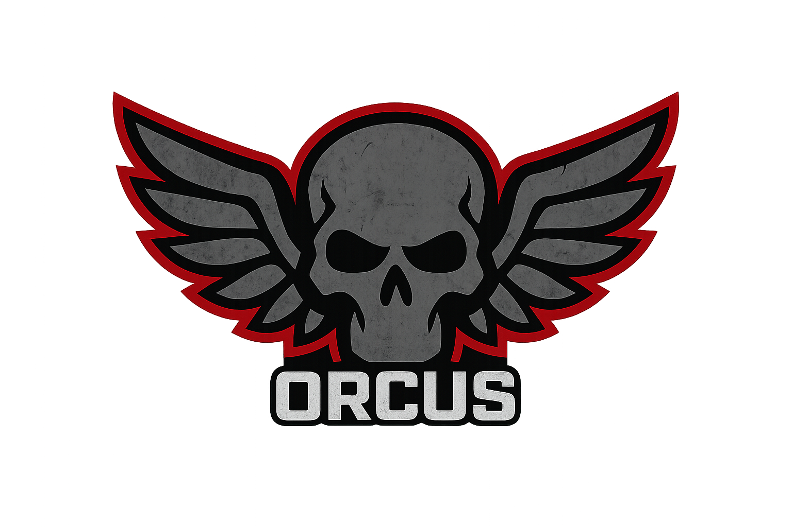
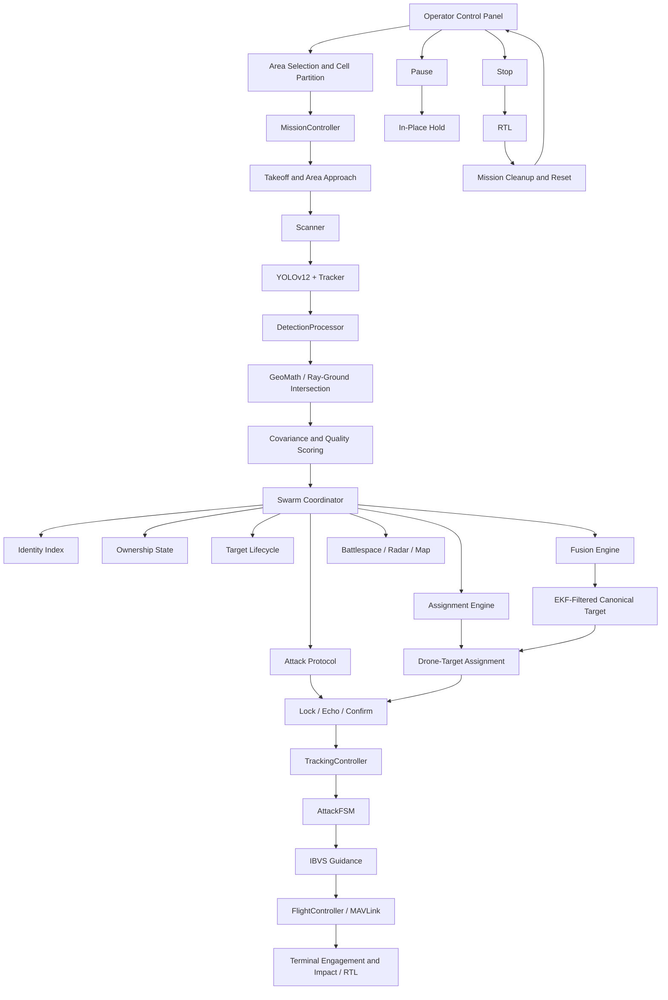
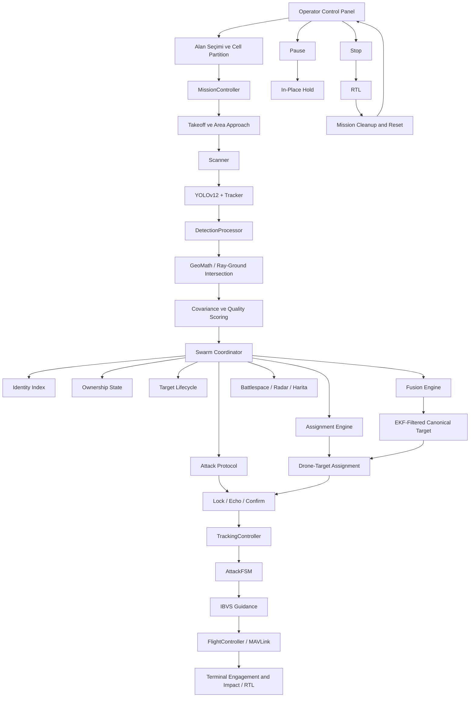

<div align="center">

# ORCUS
### Autonomous Swarm Kamikaze Drone System



[](https://www.python.org/)
[](https://www.ros.org/)
[](http://gazebosim.org/)
[](https://github.com/ultralytics/ultralytics)
[](https://opencv.org/)
[](https://flask.palletsprojects.com/)
[](https://dronekit.io/)
[](https://www.docker.com/)
[](LICENSE)

[](https://github.com/koesan/ORCUS/blob/main/image/demo.mp4)

🎥 **Demo Video**  
<p align="center">
  <a href="https://youtu.be/V8X-XiSy9as">
    
  </a>
</p>

---

🇬🇧[English](#-english-documentation) | 🇹🇷[Türkçe](#-türkçe-dokümantasyon)

</div>

---

# 📚 English Documentation

## What Is ORCUS?

**ORCUS** is a **fully autonomous swarm kamikaze drone system** designed to fuse perception, localization, coordination, and terminal attack execution into a single operational stack. The current stable release in this repository is **v2.1**.

The system detects **both individual and grouped targets**, estimates their geo-location from monocular imagery, fuses observations coming from multiple drones into a shared battlespace picture, computes the most rational drone-to-target match, and drives terminal engagement through a guarded attack protocol.

This is not a "flying demo" architecture. ORCUS is built to:

- detect targets and **estimate where they are**
- distinguish **single entities and grouped targets**
- turn local detections into a **canonical battlespace model**
- assign the **most appropriate platform**, not merely the first observer
- preserve terminal autonomy while preventing unstable swarm-side interference
- restart missions without poisoning the next cycle with stale state

---

## Highlighted Capabilities

- **Ray-Ground Intersection (RGI) geo-localization:** Monocular detections are projected onto the ground plane to produce target GPS with covariance-aware confidence.
- **EKF-backed multi-drone sensor fusion:** Observations from separate drones are consolidated into a single canonical target representation while suppressing duplicates and noise.
- **Individual / group target discrimination:** The system models both single entities and grouped targets such as `2x` and `3x`, and carries group size into downstream decision logic.
- **Hungarian-based dynamic attack assignment:** Drone-to-target pairing is optimized using distance, visibility, target quality, and ownership state.
- **Family-aware deconfliction and target isolation:** Similar, nearby, or same-family targets are protected against false merge, false lock, overwrite, and double-attack conditions.
- **Handshake-driven terminal attack pipeline:** Lock, echo, confirmation, and terminal phases are explicitly separated rather than blended into a loose attack trigger.
- **IBVS-driven terminal guidance:** Final approach and dive commands are generated directly from image-space feedback.
- **Operator-grade control panel:** Radar, map, target ownership, drone states, and mission buttons are unified in a single web control surface.
- **Lifecycle and ownership state machine:** States such as `FREE`, `OWNED`, `LOCKED`, `CONFIRMED_ATTACK`, and `ATTACKING` keep the swarm decision layer deterministic.

---

## End-to-End Workflow


```mermaid
flowchart TD
    A[Operator Control Panel] --> B[Area Selection and Cell Partition]
    B --> C[MissionController]
    C --> D[Takeoff and Area Approach]
    D --> E[Scanner]
    E --> F[YOLOv12 + Tracker]
    F --> G[DetectionProcessor]
    G --> H[GeoMath / Ray-Ground Intersection]
    H --> I[Covariance and Quality Scoring]
    I --> J[Swarm Coordinator]

    J --> K[Identity Index]
    J --> L[Ownership State]
    J --> M[Target Lifecycle]
    J --> N[Fusion Engine]
    J --> O[Assignment Engine]
    J --> P[Attack Protocol]
    J --> Q[Battlespace / Radar / Map]

    N --> R[EKF-Filtered Canonical Target]
    O --> S[Drone-Target Assignment]
    P --> T[Lock / Echo / Confirm]

    R --> S
    S --> T
    T --> U[TrackingController]
    U --> V[AttackFSM]
    V --> W[IBVS Guidance]
    W --> X[FlightController / MAVLink]
    X --> Y[Terminal Engagement and Impact / RTL]

    A --> AB[Pause]
    A --> AC[Stop]
    AB --> AD[In-Place Hold]
    AC --> AE[RTL]
    AE --> AF[Mission Cleanup and Reset]
    AF --> A
```

---

## System Architecture

ORCUS uses a modular architecture rather than a monolithic mission script. Responsibilities are separated cleanly so that perception, swarm logic, and flight behavior can evolve without destabilizing the entire system.

### Layers

| Layer | Primary Modules | Role |
|---|---|---|
| `core` | `fleet_manager`, `geo_math`, `logger`, `pid_controller` | platform control, math utilities, logging, low-level helpers |
| `vision` | `detector`, `camera_handler`, `group_tracker`, `tracker/` | detection, tracking, group analysis, camera processing |
| `mission` | `mission_controller`, `navigation`, `scanner`, `tracking_controller`, `attack_fsm`, `ibvs_guidance`, `swarm_bridge` | mission execution, target tracking, attack FSM, command generation |
| `swarm` | `coordinator`, `target`, `state_machine`, `assignment`, `ownership`, `protocol`, `fusion_engine`, `target_fusion`, `battlespace` | swarm decisions, target lifecycle, fusion, assignment, radar/map view |

### Core Architectural Principles

- **One physical target, one canonical record:** Local tracker identities are mapped into a shared registry.
- **Perception and decision are separated:** Vision produces evidence; swarm logic makes commitment decisions.
- **State-first control:** Attack, hover, lost, and reset behavior are managed as state transitions, not scattered conditionals.
- **Leader authority with terminal autonomy:** The leader coordinates assignment; the drone executes the last phase without unstable micromanagement.
- **Unified modeling of individuals and groups:** Single targets and grouped targets coexist in the same battlespace, but they are not processed blindly as the same entity.
- **Deterministic mission cycling:** Pause, stop, resume, and restart belong to the same controlled mission lifecycle.

---

## Core Algorithms

### 1. Geo-Localization and Target Position Estimation

ORCUS is built around **position credibility**, not detection alone. It uses **Ray-Ground Intersection (RGI)** to intersect the camera ray with the ground plane and produce a world-coordinate estimate for each target.

That chain is:

1. extract the image-space target center
2. apply camera model and drone pose
3. compute a GPS hypothesis via RGI
4. attach covariance / sigma rather than a blind point estimate
5. feed that confidence into fusion, assignment, and radar decisions

This allows the system to say not only "the target is here," but also "the target is here with this level of confidence."

### 2. Sensor Fusion and Canonical Target Construction

In a multi-drone scene, the same physical target may appear under different local tracker IDs. In addition, the scene may contain both **single entities and grouped targets**. ORCUS evaluates:

- spatial proximity
- group-size evidence
- local identity overlap
- covariance quality
- ownership and attack-pipeline protections

The objective is not to merge aggressively. The objective is to:

- avoid showing the same target twice
- avoid merging physically separate targets
- avoid corrupting an active attack family with unrelated observations

That is why v2.1 favors **controlled fusion, duplicate suppression, and family-aware guards** over naive merge pressure.

### 3. Group Analysis and Multi-Target Separation

ORCUS does not treat every detection as a flat list of unrelated blobs. The grouping pipeline:

- clusters individuals into group hypotheses
- converts clusters into group targets
- carries group member count into target metadata
- distinguishes grouped targets from single entities in radar and assignment logic
- uses group evidence in deconfliction and attack decisions

This matters in scenes such as `2x`, `2x`, `3x`, where correct target separation is mission-critical.

### 4. Dynamic Attack Assignment

The assignment engine abandons the simplistic "first observer attacks" pattern. Instead, it builds a cost model using:

- drone-to-target distance
- visibility
- target quality
- covariance
- ownership state
- immutable attack protections

It then solves the pairing with the **Hungarian algorithm**, reducing duplicate commitments, cross-over routes, and uneven load distribution across the swarm.

### 5. Deconfliction, Ownership, and Swarm Isolation

Once a target family enters the attack pipeline, nearby duplicates or wrong family evidence can destabilize the system. ORCUS counters this with:

- immutable terminal attack states
- proximity lock guards
- family evidence checks
- group-size and group-member validation
- owner / reserved / handoff ownership modeling

This prevents same-target pile-on, family contamination, and overwrite during terminal engagement.

---

## Attack Execution Logic

The attack path is not a single loose trigger. ORCUS runs a guarded engagement handshake:

1. the leader approves the target
2. the drone requests lock
3. the leader validates lock and ownership
4. the drone echoes the target for verification
5. the leader confirms engagement
6. the drone enters centering
7. IBVS drives the terminal dive

The goal is to avoid a system that jumps directly from a noisy positive to a dive command. ORCUS separates **detection**, **commitment**, and **terminal execution** on purpose.

This pipeline also:

- stabilizes representative target choice in grouped scenes
- blocks mid-attack target swaps
- preserves a controlled contract between leader decisions and terminal drone behavior

---

## Evolution: v2.0 vs v2.1

| Topic | v2.0 | v2.1 |
|---|---|---|
| Swarm architecture | leader-follower core | modular coordinator + lifecycle + protocol + ownership layers |
| Target fusion | working but more fragile merge/fusion path | stronger canonical target logic, duplicate suppression, family evidence |
| Geo-localization | RGI-based estimate | RGI + filtered target pipeline + covariance-aware stability |
| Assignment | Hungarian-based pairing | assignment guards, family suppression, attack-aware distribution |
| Group handling | more limited practical separation | stronger individual/group discrimination and grouped-target metadata |
| Attack protocol | baseline approval flow | 7-step handshake with lock / echo / confirm separation |
| State management | more vulnerable mission transitions | soft reset, pause/resume, stop interlocks, runtime cleanup |
| UI safety | looser command behavior | stronger Start / Pause / Stop interlocks |
| Chronic failure classes addressed | state leak, overwrite, stale attack instability, pause-side radar drift risk | guarded and hardened in the v2.1 architecture |
| Operational stability | demonstration-grade | significantly hardened for repeatable runs and GitHub release quality |

---

## Repository Layout

```text
ORCUS-main/
├── app.py
├── config.py
├── modules/
│   ├── core/
│   ├── mission/
│   ├── swarm/
│   └── vision/
├── simulator/
├── static/
├── templates/
├── tests/
├── logs/
└── README.md
```

---

## � Installation & Setup

### Prerequisites
- Ubuntu 20.04
- Python 3.8+
- ROS Noetic

### Step 1: Setup Simulation Environment

Follow the complete setup instructions in our Docker-based simulation repository:

🔗 **[ArduGazeboSim-Docker Repository](https://github.com/koesan/ArduGazeboSim-Docker)**

This includes:
- Docker installation
- ROS package setup
- ArduPilot SITL installation
- Gazebo simulation environment

### Step 2: Clone ORCUS Project

```bash
cd ArduGazeboSim
git clone https://github.com/koesan/ORCUS.git
```

### Step 3: Configure Drone Models & World

```bash
# Copy drone models with cameras
cp -r ORCUS/simulator/drone/drone1/* catkin_ws/src/iq_sim/models/drone1/
cp -r ORCUS/simulator/drone/drone2/* catkin_ws/src/iq_sim/models/drone2/

# Copy world file with human actors
cp ORCUS/simulator/worlds/multi_drone.world catkin_ws/src/iq_sim/worlds/
```

---

## 🎮 Running the System

### Terminal 1: Launch Simulation
```bash
roslaunch iq_sim multi_drone.launch
```

### Terminal 2-3: Connect Drones
```bash
# Terminal 2 - Drone 1
sim_vehicle.py -v ArduCopter -f gazebo-iris -I0

# Terminal 3 - Drone 2
sim_vehicle.py -v ArduCopter -f gazebo-iris -I1
```

### Terminal 4: Start ORCUS Control Hub
```bash
cd ArduGazeboSim/ORCUS
pip3 install -r requirements.txt
python3 app.py
```

### Access Web Interface
```
http://localhost:5000/
```

---

## Why v2.1?

Because this release is not just "more features." It is a stability-focused hardening step that separates:

- seeing a target from locating it correctly
- observing a target from owning it
- approving an attack from executing a terminal strike
- stopping a mission from leaving hidden mission state behind

That separation is what turns a demo chain into a serious systems-engineering project.

---

## 📄 License

This project is licensed under the Apache License 2.0 - see the [LICENSE](LICENSE) file for details.

---

## ⚠️ Disclaimer

This project is for **educational and research purposes only**. The developers are not responsible for any misuse of this system. Always comply with local laws and regulations regarding drone operations.

---

# 📚 Türkçe Dokümantasyon

## ORCUS Nedir?

**ORCUS**, çoklu platformun ortak algı, ortak hedef resmi ve koordineli terminal taarruz mantığıyla çalıştığı **tam otonom bir sürü kamikaze drone sistemidir**. Bu depodaki mevcut kararlı sürüm **v2.1**'dir.

Sistem; sahadaki **bireyleri ve grup hedeflerini** görüntüden çıkarır, hedeflerin coğrafi konumunu hesaplar, farklı platformlardan gelen gözlemleri tek hedef resmine birleştirir, sürü içinde en doğru drone-hedef eşleşmesini üretir ve terminal taarruzu kontrollü bir protokol üzerinden yürütür.

Bu mimari yalnızca "uçan bir demo" üretmek için kurulmadı. ORCUS:

- hedefi sadece görmez, **konumunu hesaplar**
- tekil birey ile **grup hedefi** ayırt eder
- yerel tespitleri **kanonik bir battlespace resmine** dönüştürür
- ilk göreni değil, **en uygun platformu** hedefe yollar
- terminal fazda gereksiz lider müdahalesini keser, ama sürü güvenliğini korur
- görev çevrimleri arasında stale state, overwrite ve kararsızlık üretmeden yeniden çalışabilir

---

## Öne Çıkan Yetenekler

- **Ray-Ground Intersection (RGI) tabanlı monoküler coğrafi konumlandırma:** Kamera ışınını zeminle kestirerek hedef GPS üretir; karar katmanına kovaryansla birlikte besler.
- **EKF destekli çoklu drone sensor fusion:** Aynı fiziksel hedefe ait farklı gözlemler tek kanonik hedefte toplanır, gürültü filtrelenir, yalancı duplicate'ler bastırılır.
- **Birey / grup hedef ayrıştırma ve group clustering:** Sistem sahadaki tekil bireyleri ve `2x`, `3x` gibi grup hedeflerini ayrı kategoriler olarak izler; grup boyutu karar katmanına taşınır.
- **Hungarian tabanlı dinamik saldırı ataması:** Drone-hedef eşleşmesi mesafe, kalite, görünürlük ve sahiplik durumlarına göre optimize edilir.
- **Family-aware deconfliction, grouping ve target isolation:** Yakın, benzer veya aynı aileye ait birey/grup hedeflerde yanlış merge, yanlış lock, grup overwrite ve çift saldırı riskini baskılar.
- **Handshake kontrollü terminal taarruz hattı:** Lock, echo, doğrulama ve attack fazları birbirinden ayrılmıştır; terminal faz kontrollü ama gereksiz müdahalesiz yürütülür.
- **IBVS tabanlı terminal guidance:** Görüntü merkezleme ve dalış komutları doğrudan görüntü tabanlı servo mantığıyla üretilir.
- **Operatör merkezli kontrol paneli:** Radar, harita, hedef sahipliği, drone görev durumu ve görev butonları tek web komuta ekranında birleşir.
- **Ownership ve lifecycle state machine:** `FREE`, `OWNED`, `LOCKED`, `CONFIRMED_ATTACK`, `ATTACKING` gibi hedef durumları karar akışını deterministik tutar.

---

## Uçtan Uca İş Akışı


```mermaid
flowchart TD
    A[Operator Control Panel] --> B[Alan Seçimi ve Cell Partition]
    B --> C[MissionController]
    C --> D[Takeoff ve Area Approach]
    D --> E[Scanner]
    E --> F[YOLOv12 + Tracker]
    F --> G[DetectionProcessor]
    G --> H[GeoMath / Ray-Ground Intersection]
    H --> I[Covariance ve Quality Scoring]
    I --> J[Swarm Coordinator]

    J --> K[Identity Index]
    J --> L[Ownership State]
    J --> M[Target Lifecycle]
    J --> N[Fusion Engine]
    J --> O[Assignment Engine]
    J --> P[Attack Protocol]
    J --> Q[Battlespace / Radar / Harita]

    N --> R[EKF-Filtered Canonical Target]
    O --> S[Drone-Target Assignment]
    P --> T[Lock / Echo / Confirm]

    R --> S
    S --> T
    T --> U[TrackingController]
    U --> V[AttackFSM]
    V --> W[IBVS Guidance]
    W --> X[FlightController / MAVLink]
    X --> Y[Terminal Engagement and Impact / RTL]

    A --> AB[Pause]
    A --> AC[Stop]
    AB --> AD[In-Place Hold]
    AC --> AE[RTL]
    AE --> AF[Mission Cleanup and Reset]
    AF --> A
```

---

## Sistem Mimarisi

ORCUS, tek dosyaya sıkışmış bir görev mantığı yerine, sorumlulukları açık biçimde ayrılmış modüler bir mimari kullanır. Böylece algılama, sürü zekası ve uçuş kontrolü aynı proje içinde birlikte çalışırken birbirini kırmadan gelişebilir.

### Katmanlar

| Katman | Ana Modüller | Rol |
|---|---|---|
| `core` | `fleet_manager`, `geo_math`, `logger`, `pid_controller` | platform yönetimi, matematiksel yardımcılar, kayıt ve temel kontrol |
| `vision` | `detector`, `camera_handler`, `group_tracker`, `tracker/` | tespit, takip, grup analizi ve kamera işleme |
| `mission` | `mission_controller`, `navigation`, `scanner`, `tracking_controller`, `attack_fsm`, `ibvs_guidance`, `swarm_bridge` | görev akışı, hedef takibi, attack FSM ve komut üretimi |
| `swarm` | `coordinator`, `target`, `state_machine`, `assignment`, `ownership`, `protocol`, `fusion_engine`, `target_fusion`, `battlespace` | sürü kararı, hedef yaşam döngüsü, füzyon, atama ve radar/harita görünümü |

### Temel Mimari İlkeler

- **Tek fiziksel hedef, tek kanonik kayıt:** Yerel tracker kimlikleri ortak hedef kaydına bağlanır.
- **Observation ile decision ayrımı:** Görüntü verisi kanıt üretir; sürü katmanı karar verir.
- **State-first yaklaşım:** Attack, hover, lost ve reset davranışları dağınık koşullarla değil, durum geçişleriyle yönetilir.
- **Leader authority + terminal autonomy:** Lider atama ve sürü koordinasyonunu yönetir; drone terminal fazı kontrollü biçimde yürütür.
- **Birey ve grup için ortak ama bilinçli model:** Tekil hedefler ve grup hedefleri aynı battlespace içinde tutulur, ancak körlemesine aynı nesne gibi işlenmez.
- **Deterministik görev çevrimi:** Pause, stop, resume ve yeniden başlatma aynı görev yaşam döngüsünün parçasıdır.

---

## Çekirdek Algoritmalar

### 1. Konum Tespiti ve Coğrafi Kestirim

ORCUS'un en kritik unsurlarından biri **konum tespiti doğruluğudur**. Sistem yalnızca bbox üretmez; **Ray-Ground Intersection (RGI)** ile kamera ışınını zemin düzlemiyle kesiştirerek hedefin dünya koordinatını kestirir.

Bu zincir:

1. görüntüde bbox merkezi çıkarılır
2. kamera modeli ve drone duruşu uygulanır
3. RGI ile hedef GPS hipotezi üretilir
4. sonuç sadece tek nokta değil, **kovaryans / sigma** ile birlikte taşınır
5. bu güven metriği fusion, assignment ve radar kararlarına beslenir

Bu sayede sistem yalnızca "hedef burada olabilir" demez; "hedef burada ve bu kadar güvenilir" diyebilir.

### 2. Sensor Fusion ve Kanonik Hedef Üretimi

Çoklu drone sahaya baktığında aynı fiziksel hedef farklı local ID'lerle görülebilir. Üstelik sahne sadece bireylerden değil, **grup hedeflerinden** de oluşabilir. ORCUS bu verileri:

- mekansal yakınlık
- grup boyutu kanıtı
- local identity eşleşmesi
- kovaryans kalitesi
- sahiplik ve attack pipeline korumaları

üzerinden değerlendirir.

Amaç agresif merge yapmak değildir. Amaç:

- aynı hedefi iki kez göstermemek
- farklı fiziksel hedefleri yanlış birleştirmemek
- aktif saldırı hattını alakasız gözlemlerle kirletmemektir

Bu nedenle v2.1, **kontrollü füzyon, duplicate suppression ve family-aware guard** mantığını kullanır.

### 3. Grup Analizi ve Çoklu Hedef Ayrıştırma

ORCUS her tespiti düz bir hedef listesi gibi işlemez. Grup analizi hattı:

- bireyleri kümeler
- kümeleri grup hedefe dönüştürür
- grup üye sayısını hedef metadata'sına taşır
- radar görünümünde grup hedefleri tekil hedeflerden ayırır
- assignment ve deconfliction kararlarında bu bilgiyi kullanır

Bu katman özellikle `2x`, `2x`, `3x` gibi sahne düzenlerinde kritik fark yaratır; çünkü karar motoru artık sadece koordinata değil, hedefin **birey mi grup mu** olduğuna da bakar.

### 4. Dynamic Assignment / Dinamik Saldırı Ataması

Atama motoru, ilk görenin saldırdığı kaba mantığı terk eder. Bunun yerine:

- drone-hedef mesafesi
- görünürlük
- hedef kalitesi
- kovaryans
- sahiplik durumu
- immutable attack korumaları

üzerinden bir maliyet matrisi kurar ve **Hungarian algoritması** ile en uygun eşleşmeyi üretir.

Sonuç: sürü içinde aynı hedefe yığılma, gereksiz çapraz rota ve asimetrik yüklenme azalır.

### 5. Çakışma Önleme, Sahiplik ve Sürü İzolasyonu

Bir hedef family’si saldırı hattına girdikten sonra, yakın duplicate veya yanlış grup üyeliği başka drone'ları da aynı aileye çekebilir. ORCUS bunu şu yapılarla baskılar:

- immutable terminal attack state'leri
- proximity lock guard
- family evidence kontrolleri
- grup boyutu ve group-member doğrulaması
- owner / reserved / handoff sahiplik modeli

Bu sayede aynı hedefe çift saldırı, family contamination ve terminal overwrite riski azaltılır.

---

## Taarruz Yürütme Mantığı

Taarruz hattı tek bir gevşek tetikleyiciyle başlamaz. ORCUS kontrollü bir el sıkışma protokolü kullanır:

1. lider hedefi onaylar
2. drone lock ister
3. lider lock ve ownership durumunu doğrular
4. drone echo ile hedefi tekrar teyit eder
5. lider saldırıyı doğrular
6. drone centering fazına girer
7. IBVS terminal dalışı yürütür

Amaç, false positive lock ile doğrudan dalışa giden zayıf mimariden uzak durmak; saldırı kararını doğrulamak ve terminal fazda gereksiz state salınımını önlemektir.

Bu hat aynı zamanda:

- grup hedeflerde temsilci hedef seçimini kararlı tutar
- mid-attack target swap riskini baskılar
- lider kararı ile terminal drone davranışı arasında kontrollü bir rol ayrımı kurar

---

## v2.0 -> v2.1 Evrimi

| Başlık | v2.0 | v2.1 |
|---|---|---|
| Sürü mimarisi | leader-follower temel yapı | modüler coordinator + lifecycle + protocol + ownership katmanları |
| Hedef birleştirme | çalışan ama daha kırılgan merge/fusion akışı | duplicate suppression, family evidence ve daha kontrollü canonical target yapısı |
| Konum tespiti | RGI tabanlı konum kestirimi | RGI + filtered target pipeline + covariance farkındalığı |
| Görev atama | Hungarian temelli atama | assignment guard, family suppression ve attack-aware dağıtım |
| Grup yönetimi | daha sınırlı pratik ayrıştırma | daha güçlü birey/grup ayrımı ve grup metadata hattı |
| Attack protokolü | temel onay akışı | 7 adımlı handshake, lock/echo/confirm ayrımı, terminal immutability |
| State yönetimi | görev geçişlerinde daha kırılgan alanlar | soft reset, pause/resume, stop interlock ve runtime cleanup zinciri |
| UI güvenlik kilitleri | daha gevşek | Start/Pause/Stop interlock mantığı ve tekrar başlatma güvenliği |
| Çözülen kronik sorunlar | state leak, hedef overwrite, stale attack kararsızlığı, pause sonrası radar bozulması riski | bu sınıflar v2.1'de sistematik guard ve reset mimarisiyle sertleştirildi |
| Operasyonel kararlılık | demo seviyesinde işleyen | tekrar çalıştırılabilir, daha sertleştirilmiş ve GitHub yayınına uygun |

---

## Dizin Yapısı

```text
ORCUS-main/
├── app.py
├── config.py
├── modules/
│   ├── core/
│   ├── mission/
│   ├── swarm/
│   └── vision/
├── simulator/
├── static/
├── templates/
├── tests/
├── logs/
└── README.md
```

---

## 🚀 Kurulum ve Yapılandırma

### Gereksinimler(Zorunlı)
- Ubuntu 20.04
- Python 3.8+
- ROS Noetic

### Adım 1: Simülasyon Ortamı Kurulumu

Docker tabanlı simülasyon deposundaki kurulum talimatlarını takip edin:

🔗 **[ArduGazeboSim-Docker Deposu](https://github.com/koesan/ArduGazeboSim-Docker)**

Bu şunları içerir:
- Docker kurulumu
- ROS paket kurulumu
- ArduPilot SITL kurulumu
- Gazebo simülasyon ortamı

### Adım 2: ORCUS Projesini Klonlama

```bash
cd ArduGazeboSim
git clone https://github.com/koesan/ORCUS.git
```

### Adım 3: Drone Modelleri ve Dünya Yapılandırması

```bash
# Kamereli drone modellerini kopyala
cp -r ORCUS/simulator/drone/drone1/* catkin_ws/src/iq_sim/models/drone1/
cp -r ORCUS/simulator/drone/drone2/* catkin_ws/src/iq_sim/models/drone2/

# İnsan aktörlü dünya dosyasını kopyala
cp ORCUS/simulator/worlds/multi_drone.world catkin_ws/src/iq_sim/worlds/
```

---

## 🎮 Sistemi Çalıştırma

### Terminal 1: Simülasyonu Başlat
```bash
roslaunch iq_sim multi_drone.launch
```

### Terminal 2-3: Drone'ları Bağla
```bash
# Terminal 2 - Drone 1
sim_vehicle.py -v ArduCopter -f gazebo-iris -I0

# Terminal 3 - Drone 2
sim_vehicle.py -v ArduCopter -f gazebo-iris -I1
```

### Terminal 4: ORCUS Kontrol Merkezini Başlat
```bash
cd ArduGazeboSim/ORCUS
pip3 install -r requirements.txt
python3 app.py
```

### Web Arayüzüne Eriş
```
http://localhost:5000/
```

---

## 📄 Lisans

Bu proje Apache Lisansı 2.0 altında lisanslanmıştır - detaylar için [LICENSE](LICENSE) dosyasına bakın.

---

## ⚠️ Yasal Uyarı

Bu proje **eğitim ve araştırma amaçlıdır**. Geliştiriciler bu sistemin kötüye kullanımından sorumlu değildir. Her zaman drone operasyonlarıyla ilgili yerel yasalara ve düzenlemelere uyun.
