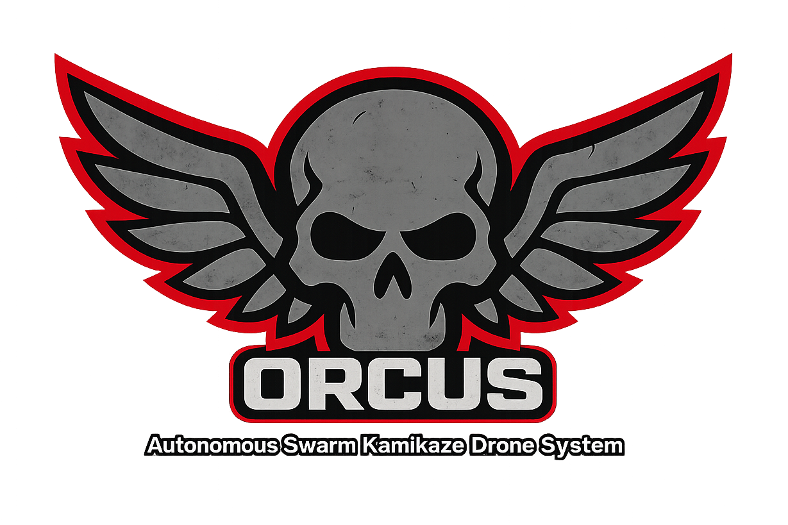
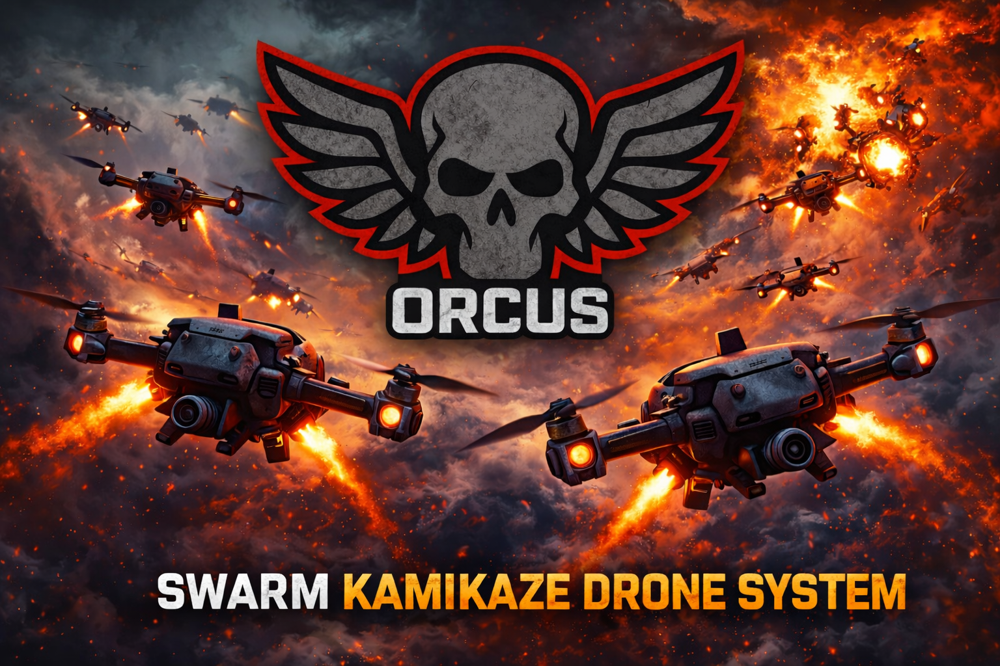
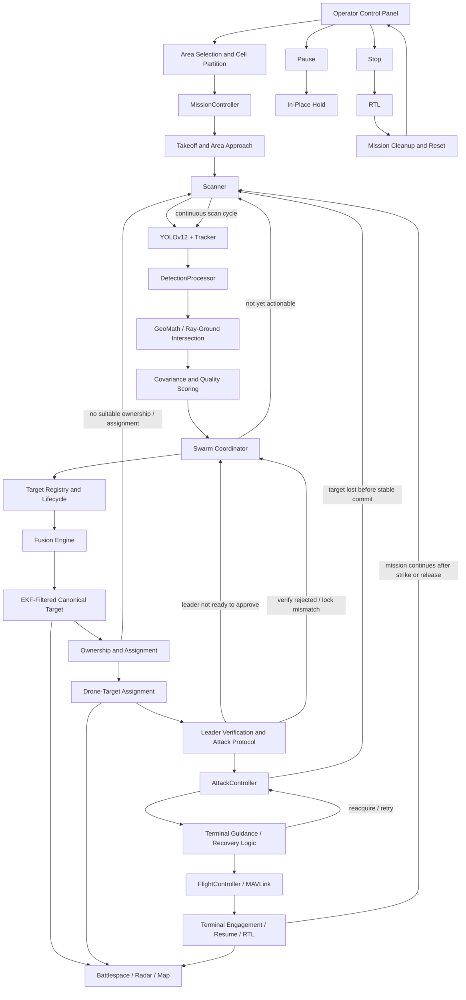
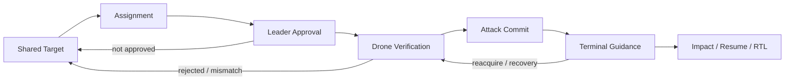
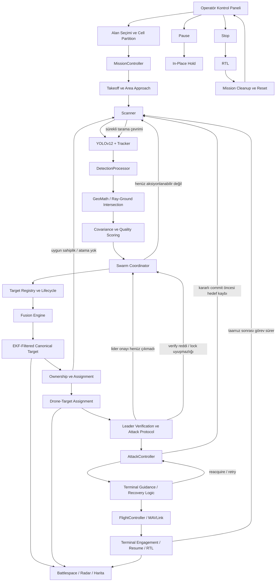
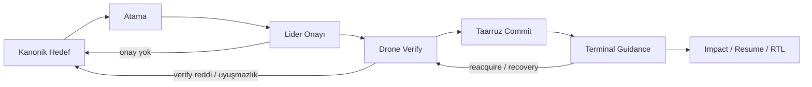

<div align="center">

# ORCUS v2.3

### Swarm Kamikaze Drone System



[](https://www.python.org/)
[](https://www.ros.org/)
[](http://gazebosim.org/)
[](https://github.com/ultralytics/ultralytics)
[](https://opencv.org/)
[](https://flask.palletsprojects.com/)
[](https://dronekit.io/)
[](https://www.docker.com/)
[](LICENSE)

[](https://youtu.be/V8X-XiSy9as)

🎥 **Demo Video**  

<p align="center">
  <a href="https://youtu.be/V8X-XiSy9as">
    
  </a>
</p>

---

🇬🇧[English](#-english-documentation) | 🇹🇷[Türkçe](#-türkçe-dokümantasyon)

</div>

---

# 📚 English Documentation

## What Is ORCUS?

**ORCUS** is a **fully autonomous swarm kamikaze drone system** that brings perception, geo-localization, swarm coordination, verification, and terminal attack execution together inside one system. The current stable release in this repository is **v2.3**.

The system detects **individuals and grouped targets** in the field, computes where those targets are on the ground, combines observations coming from different drones into one shared target picture, finds the most suitable drone-target match across the swarm, and runs terminal engagement through a controlled multi-stage attack chain.

ORCUS:

- does not just see the target, it **computes its position**
- can **group individual detections**
- combines observations coming from different drones into **one shared target picture**
- assigns the target to the **most suitable platform**, not simply the first observer
- runs the attack through a **controlled approval chain**
- keeps visual tracking alive during terminal flight and tries to **recover** from short disruptions
- stays restartable by reducing hidden runtime state that can leak across missions

---

## Highlighted Capabilities

- **DBSCAN-based grouping:** Nearby detections are clustered in metric space before they are promoted to leader-side targets. This reduces tracker jitter, cuts repeated geo-localization work, lowers the number of targets sent to the leader, and makes downstream fusion easier to manage.
- **RGI-based geo-localization:** Each usable observation is projected from camera geometry into world coordinates. The system carries not only position, but also uncertainty.
- **Covariance-aware target fusion:** Multi-drone observations are merged into one shared target structure while suppressing duplicates, noise, and unstable overwrites.
- **EKF / Kalman target filtering:** Shared target state is filtered on the leader side so radar jumps, target drift, and unstable assignment behavior are reduced.
- **Hungarian-based dynamic assignment:** Drone-to-target matching is solved over a global cost matrix, so target distribution is deliberate rather than accidental.
- **Family-aware ownership and deconfliction:** Once a target family enters the attack pipeline, late low-quality observations or nearby duplicates are prevented from breaking that commitment.
- **Verification-driven attack protocol:** Assignment, verification, and terminal attack are kept separate; the system does not treat them as one loose trigger.
- **BBox-first terminal guidance:** Final approach is driven from live visual reference, with bounded reacquire and recovery behavior when visual quality degrades.
- **Shared battlespace view:** Radar, map, target ownership, drone state, and mission outcomes are all built from the same shared target picture.
- **Controlled mission lifecycle:** Pause, stop, RTL, cleanup, and restart are treated as parts of one mission cycle rather than disconnected commands.

---

## End-to-End Workflow


```mermaid
flowchart TD
    A[Operator Control Panel] --> B[Area Selection and Cell Partition]
    B --> C[MissionController]
    C --> D[Takeoff and Area Approach]
    D --> E[Scanner]
    E --> F[YOLOv12 + Tracker]
    F --> G[DetectionProcessor]
    G --> H[GeoMath / Ray-Ground Intersection]
    H --> I[Covariance and Quality Scoring]
    I --> J[Swarm Coordinator]

    J --> K[Target Registry and Lifecycle]
    K --> L[Fusion Engine]
    L --> M[EKF-Filtered Canonical Target]
    M --> N[Ownership and Assignment]
    N --> O[Drone-Target Assignment]
    O --> P[Leader Verification and Attack Protocol]
    P --> Q[AttackController]
    Q --> R[Terminal Guidance / Recovery Logic]
    R --> S[FlightController / MAVLink]
    S --> T[Terminal Engagement / Resume / RTL]

    M --> U[Battlespace / Radar / Map]
    O --> U
    T --> U

    E -->|continuous scan cycle| F
    J -->|not yet actionable| E
    N -->|no suitable ownership / assignment| E
    P -->|leader not ready to approve| J
    P -->|verify rejected / lock mismatch| J
    Q -->|target lost before stable commit| E
    R -->|reacquire / retry| Q
    T -->|mission continues after strike or release| E

    A --> V[Pause]
    A --> W[Stop]
    V --> X[In-Place Hold]
    W --> Y[RTL]
    Y --> Z[Mission Cleanup and Reset]
    Z --> A
```

## System Architecture

ORCUS uses a modular architecture rather than a monolithic mission script. Responsibilities are separated cleanly so that perception, swarm logic, mission execution, and flight behavior can evolve without destabilizing the entire system.

### Layers

| Layer     | Primary Modules                                                                               | Role                                                                                      |
| --------- | --------------------------------------------------------------------------------------------- | ----------------------------------------------------------------------------------------- |
| `core`    | `fleet_manager`, `geo_math`, `logger`, `pid_controller`, `comm`                               | platform control, math utilities, canonical state definitions, logging, low-level helpers |
| `vision`  | `detector`, `camera_handler`, `group_tracker`, `detection_processor`                          | detection, tracking, group analysis, observation normalization, camera processing         |
| `mission` | `mission_controller`, `navigation`, `attack_controller`, `flight_controller`, `follower_link` | mission execution, drone-side attack flow, movement control, command generation           |
| `swarm`   | `coordinator`, `target`, `assignment`, `leader_link`, `target_fusion`, `battlespace`          | swarm decisions, target lifecycle, fusion, assignment, verification, radar/map view       |

### Core Architectural Principles

- **Leader-side coordination, drone-side execution:** The leader keeps the shared target picture, assignment, and verification; the drone handles movement and terminal execution.
- **Modular separation of responsibility:** Vision, swarm, mission, and control are kept separate instead of being mixed into one large mission script.
- **Observation is not commitment:** A detection can remain just an observation, become a tracked target, or become an attack candidate depending on stability and evidence quality.
- **One shared target picture:** Different drones do not operate on competing local truths; their observations are reconciled into one shared target view.
- **Group-aware target reasoning:** Individual detections and grouped targets are handled inside the same structure, with grouping evidence kept in the decision chain.
- **Deterministic mission lifecycle:** Pause, stop, RTL, cleanup, and restart are handled as controlled states inside one mission loop.

---

## Core Algorithms

### 1. Grouping and Target Construction

ORCUS clusters nearby detections in metric space with **DBSCAN**. The point is not just to label a crowd as a group.

Grouping helps in three practical ways:

1. it reduces tracker fluctuation  
   One physical group is less likely to split into multiple unstable targets from frame to frame.

2. it reduces workload  
   Fewer grouped targets means fewer world-position calculations and fewer reports sent to the leader.

3. it makes the rest of the system cleaner  
   Fusion, ownership, assignment, and terminal selection all behave better when the swarm sees one coherent grouped target instead of several fragments.

In short, grouping is not cosmetic. It is the first simplification step that makes the rest of the system more stable and easier to scale.

### 2. Geo-Localization

ORCUS does not stop at seeing a target in the image. It computes where that target is on the ground with **Ray-Ground Intersection (RGI)**.

The system takes the contact point inside the bounding box, applies camera geometry, drone pose, and camera angle, then intersects that ray with the ground. The output is a world position.

The important part is that ORCUS also keeps the uncertainty of that estimate. The rest of the system does not only ask, "Where is the target?" It also asks, "How much do we trust this position?" That is why fusion, assignment, and verification can behave more carefully.

### 3. Target Fusion

After geo-localization, ORCUS must decide whether new observations belong to an existing target or to a different one. That is the fusion problem.

The fusion side looks at:

- spatial proximity
- covariance quality
- local identity evidence
- group size and family consistency
- current ownership and attack state

The goal is simple: if the evidence is strong, keep one physical target as one shared target. If the evidence is weak, refuse the merge. That balance matters. Over-aggressive fusion collapses separate targets into one. Over-weak fusion creates duplicates that the swarm starts chasing.

### 4. EKF-Based Target Filtering

Once the shared target exists, ORCUS stabilizes its world state with **EKF / Kalman filtering** on the leader side.

The reason is practical. Raw measurements jump. When raw measurements drive the decision layer directly, target position jumps with them. Filtering suppresses that motion and gives the swarm a steadier target state.

In practice, this makes the radar calmer, the target more continuous, and the assignment logic less reactive to noise.

### 5. Dynamic Assignment

ORCUS matches drones to targets with the **Hungarian algorithm**. The system builds a cost matrix from distance, visibility, target quality, covariance, current ownership, and deconfliction pressure, then solves for the best global distribution.

The benefit is straightforward: target sharing stops depending on who happened to see the target first. The swarm sees the whole field instead of making local guesses, which reduces pile-on, wasted crossing routes, and unstable contention over the same target.

### 6. Ownership and Deconfliction

After assignment, ORCUS uses ownership and deconfliction logic to stop the attack pipeline from being broken by nearby duplicates or competing claims.

This part decides:

- who owns the target
- when that ownership is sticky
- when handoff is allowed
- when nearby candidates should be treated as the same family
- when an active attack should be protected from overwrite

This is not just bookkeeping. It is what keeps multiple drones from converging on the same target family or replacing a valid attack target with a late, weaker observation.

### 7. Terminal Guidance and Recovery

Terminal control is **bbox-first**. ORCUS keeps the live visual target as the main terminal reference and drives the approach with filtered control and smoothing logic.

That matters because the last phase is no longer a static GPS problem. It is a fast-changing visual tracking problem. If visual contact stays healthy, the attack remains image-driven. If visual quality drops briefly, the system first tries bounded reacquire and recovery before giving up the path.

That makes the terminal phase more stable exactly where instability matters most.

---

## Attack Execution Logic


```mermaid
flowchart LR
    A[Shared Target] --> B[Assignment]
    B --> C[Leader Approval]
    C --> D[Drone Verification]
    D --> E[Attack Commit]
    E --> F[Terminal Guidance]
    F --> G[Impact / Resume / RTL]

    C -->|not approved| A
    D -->|rejected / mismatch| A
    F -->|reacquire / recovery| D
```

ORCUS does not treat attack execution as a one-step trigger. A target is assigned first, then approved by the leader, then verified by the drone, and only after that allowed to enter terminal guidance. If approval or verification fails, the system returns to the shared target loop instead of forcing an unstable attack.
---

## Repository Layout

```text
ORCUS-main/
├── app.py               # Flask control hub, web routes, mission commands, system entry point
├── config.py            # Global thresholds, gains, swarm rules, and attack tuning
├── modules/
│   ├── core/
│   │   ├── comm.py          # Canonical state enums, session phases, link state mapping
│   │   ├── fleet_manager.py # Drone connections, fleet utilities, controller creation
│   │   ├── geo_math.py      # RGI, covariance, distance, bearing, coordinate transforms
│   │   ├── logger.py        # Structured logs, JSONL events, throttling, mission-phase logging
│   │   └── pid_controller.py # PID helpers, low-pass filters, velocity smoothing
│   ├── mission/
│   │   ├── attack_controller.py  # Drone-side attack FSM, verify flow, terminal logic, fallback
│   │   ├── flight_controller.py  # Motion command gate and MAVLink command emission
│   │   ├── follower_link.py      # Drone-to-leader communication surface
│   │   ├── mission_controller.py # High-level mission lifecycle orchestration
│   │   └── navigation.py         # Search flow, transit, recovery, and non-terminal movement
│   ├── swarm/
│   │   ├── assignment.py    # Assignment engine, ownership, and deconfliction
│   │   ├── battlespace.py   # Radar, map, and battlespace presentation
│   │   ├── coordinator.py   # Leader-side orchestration and periodic decision loop
│   │   ├── leader_link.py   # Verification and leader-side command handling
│   │   ├── target.py        # Target registry, lifecycle, identity, and ingest logic
│   │   └── target_fusion.py # Fusion engine, EKF filters, duplicate handling
│   └── vision/
│       ├── camera_handler.py      # Camera access and frame acquisition
│       ├── detection_processor.py # Detection normalization, group handling, world projection
│       ├── detector.py            # Detection and tracking backend integration
│       └── group_tracker.py       # Group smoothing and grouped target continuity
├── simulator/
├── static/
├── templates/
├── logs/
└── README.md
```

---

## Evolution: v2.2 vs v2.3

| Topic                | v2.2                                  | v2.3                                 |
| -------------------- | ------------------------------------- | ------------------------------------ |
| Runtime target       | optimized for lower RTF and FPS runs  | optimized for higher RTF and FPS runs |
| Main operational gap | worked better when simulation was slower | works better when simulation is faster |

---

## 🚀 Installation & Setup

### Prerequisites

- Ubuntu 20.04
- Python 3.8+
- ROS Noetic

### Step 1: Setup Simulation Environment

Follow the complete setup instructions in our Docker-based simulation repository:

🔗 **[ArduGazeboSim-Docker Repository](https://github.com/koesan/ArduGazeboSim-Docker)**

This includes:

- Docker installation
- ROS package setup
- ArduPilot SITL installation
- Gazebo simulation environment

### Step 2: Clone ORCUS Project

```bash
cd ArduGazeboSim
git clone https://github.com/koesan/ORCUS.git
```

### Step 3: Configure Drone Models & World

```bash
# Copy drone models with cameras
cp -r ORCUS/simulator/drone/drone1/* catkin_ws/src/iq_sim/models/drone1/
cp -r ORCUS/simulator/drone/drone2/* catkin_ws/src/iq_sim/models/drone2/

# Copy world file with human actors
cp ORCUS/simulator/worlds/multi_drone.world catkin_ws/src/iq_sim/worlds/
```

---

## 🎮 Running the System

### Terminal 1: Launch Simulation

```bash
roslaunch iq_sim multi_drone.launch
```

### Terminal 2-3: Connect Drones

```bash
# Terminal 2 - Drone 1
sim_vehicle.py -v ArduCopter -f gazebo-iris -I0

# Terminal 3 - Drone 2
sim_vehicle.py -v ArduCopter -f gazebo-iris -I1
```

### Terminal 4: Start ORCUS Control Hub

```bash
cd ArduGazeboSim/ORCUS
pip3 install -r requirements.txt
python3 app.py
```

### Access Web Interface

```text
http://localhost:5000/
```

---

## 📄 License

This project is licensed under the Apache License 2.0 - see the [LICENSE](LICENSE) file for details.

---

## ⚠️ Disclaimer

This project is for **educational and research purposes only**. The developers are not responsible for any misuse of this system. Always comply with local laws and regulations regarding drone operations.

---

# 📚 Türkçe Dokümantasyon

## ORCUS Nedir?

**ORCUS**, algılama, coğrafi konum kestirimi, sürü koordinasyonu, doğrulama ve terminal taarruz yürütmesini aynı sistem içinde birleştiren **tam otonom bir sürü kamikaze drone sistemidir**. Bu depodaki mevcut kararlı sürüm **v2.3**'tür.

Sistem; sahadaki **bireyleri ve grup hedeflerini** görüntüden çıkarır, hedeflerin coğrafi konumunu hesaplar, farklı platformlardan gelen gözlemleri ortak bir hedef resmi içinde birleştirir, sürü içinde en doğru drone-hedef eşleşmesini üretir ve terminal taarruzu çok aşamalı, doğrulamalı bir saldırı zinciri üzerinden yürütür.

ORCUS:

- hedefi sadece görmez, **konumunu hesaplar**
- tekil bireyleri **gruplayabilir**
- farklı drone tespitlerini **tek ortak hedef resmi** içinde birleştirir
- hedefi ilk görene değil, **en uygun platforma** atar
- saldırıyı tek adımda başlatmaz, **kontrollü bir onay zinciriyle** yürütür
- terminal fazda görsel takibi korur, kısa bozulmalarda **yeniden toparlanmaya** çalışır
- görev çevrimleri arasında gizli state birikmesini azaltarak sistemi yeniden çalıştırılabilir tutar

---

## Öne Çıkan Yetenekler

- **DBSCAN tabanlı gruplaşma:** Yakın tespitler lider tarafına ayrı ayrı taşınmadan önce metre uzayında kümelenir. Bu, tracker dalgalanmasını azaltır, daha az konum hesabı yapılmasını sağlar, lidere daha az hedef gönderir ve füzyon tarafını rahatlatır.
- **RGI tabanlı coğrafi konum kestirimi:** Her uygun gözlem, kamera geometrisinden dünya koordinatına taşınır. Sistem yalnız konum değil, o konumun belirsizliğini de üretir.
- **Kovaryans farkındalıklı hedef füzyonu:** Çoklu drone gözlemleri tek ortak hedef yapısında birleştirilir; duplicate, gürültü ve kararsız overwrite baskılanır.
- **EKF / Kalman tabanlı hedef filtreleme:** Ortak hedef durumu lider tarafında filtrelenerek radar sıçraması, hedef oynaması ve kararsız atama davranışı azaltılır.
- **Hungarian tabanlı dinamik atama:** Drone-hedef eşleşmesi global maliyet tablosu üzerinden çözülür; hedef paylaşımı tesadüfi değil rasyonel hale gelir.
- **Family-aware sahiplik ve deconfliction:** Saldırı hattına giren hedef family'leri geç gelen düşük kaliteli veya yakın duplicate gözlemlerle bozulmaz.
- **Doğrulama odaklı saldırı protokolü:** Atama, doğrulama ve terminal taarruz birbirinden ayrıdır; sistem bunları tek adımda birbirine karıştırmaz.
- **BBox-first terminal guidance:** Son yaklaşım canlı görsel referansla yürütülür; kısa görsel bozulmalarda sınırlı yeniden yakalama ve toparlanma mantığı vardır.
- **Ortak battlespace görünümü:** Radar, harita, hedef sahipliği, drone durumu ve sonuç işaretleri aynı ortak hedef yapısından beslenir.
- **Kontrollü görev yaşam döngüsü:** Pause, stop, RTL, cleanup ve restart birbirinden kopuk komutlar değil, aynı görev çevriminin parçalarıdır.

---

## Uçtan Uca İş Akışı


```mermaid
flowchart TD
    A[Operatör Kontrol Paneli] --> B[Alan Seçimi ve Cell Partition]
    B --> C[MissionController]
    C --> D[Takeoff ve Area Approach]
    D --> E[Scanner]
    E --> F[YOLOv12 + Tracker]
    F --> G[DetectionProcessor]
    G --> H[GeoMath / Ray-Ground Intersection]
    H --> I[Covariance ve Quality Scoring]
    I --> J[Swarm Coordinator]

    J --> K[Target Registry ve Lifecycle]
    K --> L[Fusion Engine]
    L --> M[EKF-Filtered Canonical Target]
    M --> N[Ownership ve Assignment]
    N --> O[Drone-Target Assignment]
    O --> P[Leader Verification ve Attack Protocol]
    P --> Q[AttackController]
    Q --> R[Terminal Guidance / Recovery Logic]
    R --> S[FlightController / MAVLink]
    S --> T[Terminal Engagement / Resume / RTL]

    M --> U[Battlespace / Radar / Harita]
    O --> U
    T --> U

    E -->|sürekli tarama çevrimi| F
    J -->|henüz aksiyonlanabilir değil| E
    N -->|uygun sahiplik / atama yok| E
    P -->|lider onayı henüz çıkmadı| J
    P -->|verify reddi / lock uyuşmazlığı| J
    Q -->|kararlı commit öncesi hedef kaybı| E
    R -->|reacquire / retry| Q
    T -->|taarruz sonrası görev sürer| E

    A --> V[Pause]
    A --> W[Stop]
    V --> X[In-Place Hold]
    W --> Y[RTL]
    Y --> Z[Mission Cleanup ve Reset]
    Z --> A
```

## Sistem Mimarisi

ORCUS, tek dosyaya sıkışmış bir görev mantığı yerine modüler bir mimari kullanır. Böylece algılama, sürü zekası, görev icrası ve uçuş davranışı aynı proje içinde birlikte çalışırken birbirini bozmadan gelişebilir.

### Katmanlar

| Katman    | Ana Modüller                                                                                  | Rol                                                                                            |
| --------- | --------------------------------------------------------------------------------------------- | ---------------------------------------------------------------------------------------------- |
| `core`    | `fleet_manager`, `geo_math`, `logger`, `pid_controller`, `comm`                               | platform yönetimi, matematiksel yardımcılar, ortak durum tanımları, kayıt ve temel yardımcılar |
| `vision`  | `detector`, `camera_handler`, `group_tracker`, `detection_processor`                          | tespit, takip, grup analizi, gözlem normalize etme ve kamera işleme                            |
| `mission` | `mission_controller`, `navigation`, `attack_controller`, `flight_controller`, `follower_link` | görev akışı, drone-side attack flow, hareket kontrolü ve komut üretimi                         |
| `swarm`   | `coordinator`, `target`, `assignment`, `leader_link`, `target_fusion`, `battlespace`          | sürü kararı, hedef yaşam döngüsü, füzyon, atama, doğrulama ve radar/harita görünümü            |

### Temel Mimari İlkeler

- **Lider tarafı koordinasyon, drone tarafı icra:** Kanonik hedef resmi, atama ve doğrulama lider tarafında tutulur; hareket ve terminal yürütme drone tarafında icra edilir.
- **Modüler sorumluluk ayrımı:** Vision, swarm, mission ve control tarafları tek bir görev script'i içinde karışmak yerine ayrı sorumluluklarla çalışır.
- **Observation ile commitment ayrımı:** Bir detection önce gözlem, sonra hedef, sonra atanabilir hedef, sonra da doğrulanmış taarruz adayı haline gelir.
- **Tek ortak battlespace resmi:** Farklı drone'lardan gelen veriler rakip yerel gerçeklikler olarak değil, tek ortak hedef resmi içinde işlenir.
- **Grup-farkındalıklı hedef modeli:** Tekil ve grup hedefler aynı yapı içinde tutulur; grup bilgisi karar zincirinin aktif parçasıdır.
- **Deterministik görev çevrimi:** Pause, stop, RTL, cleanup ve restart aynı kontrollü görev yaşam döngüsünün parçalarıdır.

---

## Çekirdek Algoritmalar

### 1. Gruplama ve Hedef Üretimi

ORCUS, yakın tespitleri metre uzayında **DBSCAN** ile kümeler. Buradaki amaç yalnız “kalabalığı grup diye etiketlemek” değildir.

Gruplama üç işe aynı anda yarar:

1. tracker dalgalanmasını azaltır  
   Aynı fiziksel grup, üyeler arası küçük yer değişimleri yüzünden her karede farklı hedeflere bölünmez.

2. işlem yükünü düşürür  
   Her kutu için ayrı ayrı dünya konumu üretmek yerine daha az sayıda, daha anlamlı hedef üzerinde çalışılır.

3. lider tarafını rahatlatır  
   Daha az hedef raporu gönderildiği için füzyon, sahiplik ve atama tarafı gereksiz duplicate baskısı altında kalmaz.

Kısacası gruplaşma, yalnız algısal bir kolaylık değil; tüm sistemin kararlılığını ve ölçeklenebilirliğini artıran ilk sadeleştirme adımıdır.

### 2. Konum Tespiti ve Coğrafi Kestirim

ORCUS, bir hedefi yalnız görüntüde görmekle yetinmez; onun yerde nerede olduğunu da hesaplar. Bunun için **Ray-Ground Intersection (RGI)** kullanır.

Sistem, bbox içinden seçilen temas noktasını kamera geometrisi, drone pozu ve kamera açısı ile birlikte işler; sonra bu ışını zeminle kesiştirerek hedefin dünya koordinatını üretir.

Buradaki kritik nokta şudur: ORCUS yalnız koordinat üretmez, o koordinatın ne kadar güvenilir olduğunu da üretir. Kovaryans bilgisi bu yüzden taşınır. Çünkü sonraki adımların sorusu sadece “hedef nerede?” değildir; “bu konuma ne kadar güveniyoruz?” sorusudur.

Bu bilgi olmadan fusion kaba olur, assignment kararsızlaşır, verify hattı da gereksiz risk alır.

### 3. Hedef Füzyonu

Çoklu drone aynı fiziksel hedefi farklı anlarda, farklı açılardan ve farklı yerel kimliklerle görebilir. Füzyon tarafının işi bu gözlemleri tek ortak hedefte toplamaktır.

Bu katman karar verirken:

- mekansal yakınlığa
- kovaryans kalitesine
- grup boyutu ve family tutarlılığına
- yerel kimlik örtüşmesine
- aktif saldırı hattı korumalarına

bakar.

Doğru füzyonun faydası nettir: aynı hedef iki kez görünmez, farklı hedefler gereksiz yere birleşmez, aktif saldırı hattı sonradan gelen zayıf gözlemle bozulmaz.

### 4. EKF Tabanlı Hedef Filtreleme

Kanonik hedef üretildikten sonra bu hedefin dünya durumu **EKF / Kalman filtreleme** ile kararlı tutulur.

Filtrelemenin amacı teorik şıklık değil, pratik kararlılıktır. Gürültülü gözlemler doğrudan karar tarafına verilirse hedef konumu zıplar, radar oynar, atama kararsız hale gelir. Filtre bu oynaklığı bastırır ve hedefi zaman içinde daha tutarlı hale getirir.

Bunun faydası özellikle üç yerde görülür:

- radar ve harita sunumu daha stabil olur
- aynı hedefe verilen kararlar kare kare değişmez
- verify ve terminal öncesi hedef kayması azalır

### 5. Dinamik Atama

ORCUS, drone-hedef eşleşmesini **Hungarian algoritması** ile çözer. Yani sistem her drone ile her hedef arasındaki maliyeti çıkarır, sonra toplam maliyeti en iyi yapan dağılımı seçer.

Bu maliyetin içinde:

- mesafe
- görünürlük
- hedef kalitesi
- kovaryans
- mevcut sahiplik durumu
- deconfliction baskısı

yer alır.

Bunun doğrudan faydası şudur: sürü, hedef paylaşımını rastlantısal biçimde değil, bütün sahayı görerek yapar. Aynı hedefe yığılma azalır, gereksiz rota kesişmeleri düşer ve daha dengeli bir taarruz dağılımı oluşur.

### 6. Sahiplik ve Çakışma Önleme

Atama yapıldıktan sonra asıl kritik konu, o hedefin başka gözlemler yüzünden bozulmamasıdır. ORCUS burada sahiplik, handoff ve family-aware deconfliction mantığı kullanır.

Bu katman:

- hedefin kime ait olduğunu tutar
- ownership'in ne kadar korunacağını belirler
- handoff gerekip gerekmediğine karar verir
- yakın duplicate'lerin mevcut saldırı hattını bozmasını engeller

Bu sayede aynı hedefe iki drone'un birden yüklenmesi, geç gelen gözlemin aktif hedefi overwrite etmesi veya aynı family içindeki hedeflerin birbirine karışması ciddi ölçüde azalır.

### 7. Terminal Guidance ve Recovery

Terminal fazda ORCUS **bbox-first** çalışır. Yani drone son yaklaşımda canlı görsel referansı merkeze alır. Bu tercih önemlidir, çünkü terminal anda sahne artık statik bir GPS problemi değil, hızlı değişen bir görsel takip problemidir.

Burada kullanılan filtered PID, low-pass filtering, velocity smoothing ve lock continuity kontrolleri drone'u daha sakin ve kararlı tutar. Kısa görsel bozulmalarda sistem hemen saldırıyı düşürmez; önce sınırlı yeniden yakalama ve toparlanma mantığı dener.

Bunun pratik karşılığı şudur: terminal faz ya hep ya hiç mantığıyla değil, kontrollü toleranslarla yürür.

---

## Taarruz Yürütme Mantığı


```mermaid
flowchart LR
    A[Kanonik Hedef] --> B[Atama]
    B --> C[Lider Onayı]
    C --> D[Drone Verify]
    D --> E[Taarruz Commit]
    E --> F[Terminal Guidance]
    F --> G[Impact / Resume / RTL]

    C -->|onay yok| A
    D -->|verify reddi / uyuşmazlık| A
    F -->|reacquire / recovery| D
```

ORCUS, taarruzu tek adımlı bir tetikleme gibi ele almaz. Hedef önce atanır, sonra lider tarafından onaylanır, ardından drone tarafından doğrulanır ve ancak bundan sonra terminal guidance hattına girer. Onay ya da verify başarısız olursa sistem saldırıyı zorlamak yerine tekrar ortak hedef döngüsüne döner.

---

## Dizin Yapısı

```text
ORCUS-main/
├── app.py               # Flask kontrol merkezi, web route'ları, görev komutları, sistem giriş noktası
├── config.py            # Genel eşikler, gain'ler, swarm kuralları ve attack tuning
├── modules/
│   ├── core/
│   │   ├── comm.py          # Kanonik durum enum'ları, session fazları, link state eşleme
│   │   ├── fleet_manager.py # Drone bağlantıları, fleet yardımcıları, controller üretimi
│   │   ├── geo_math.py      # RGI, kovaryans, mesafe, bearing, koordinat dönüşümleri
│   │   ├── logger.py        # Structured log, JSONL event, throttle ve görev fazı logları
│   │   └── pid_controller.py # PID yardımcıları, low-pass filtreler, velocity smoothing
│   ├── mission/
│   │   ├── attack_controller.py  # Drone-side attack FSM, verify flow, terminal logic, fallback
│   │   ├── flight_controller.py  # Hareket komutu üretimi ve MAVLink emission
│   │   ├── follower_link.py      # Drone-to-leader iletişim yüzeyi
│   │   ├── mission_controller.py # Üst seviye görev yaşam döngüsü orkestrasyonu
│   │   └── navigation.py         # Search flow, transit, recovery ve non-terminal hareket
│   ├── swarm/
│   │   ├── assignment.py    # Assignment engine, ownership ve deconfliction
│   │   ├── battlespace.py   # Radar, harita ve battlespace sunumu
│   │   ├── coordinator.py   # Leader-side orkestrasyon ve periyodik karar döngüsü
│   │   ├── leader_link.py   # Verify ve leader-side komut işleme
│   │   ├── target.py        # Target registry, lifecycle, identity ve ingest mantığı
│   │   └── target_fusion.py # Fusion engine, EKF filtreleri, duplicate yönetimi
│   └── vision/
│       ├── camera_handler.py      # Kamera erişimi ve frame alma
│       ├── detection_processor.py # Detection normalize etme, grup işleme, world projection
│       ├── detector.py            # Detection ve tracking backend entegrasyonu
│       └── group_tracker.py       # Grup smoothing ve grouped target continuity
├── simulator/
├── static/
├── templates/
├── logs/
└── README.md
```

---

## v2.2 -> v2.3 Evrimi

| Başlık            | v2.2                                      | v2.3                                   |
| ----------------- | ----------------------------------------- | -------------------------------------- |
| Çalışma hedefi    | daha düşük RTF ve FPS koşullarına uygundu | daha yüksek RTF ve FPS koşullarına uygun |
| Temel operasyonel fark | simülasyon daha yavaşken daha rahattı      | simülasyon daha hızlıyken daha rahattır |

---

## 🚀 Kurulum ve Yapılandırma

### Gereksinimler

- Ubuntu 20.04
- Python 3.8+
- ROS Noetic

### Adım 1: Simülasyon Ortamı Kurulumu

Docker tabanlı simülasyon deposundaki kurulum talimatlarını takip edin:

🔗 **[ArduGazeboSim-Docker Deposu](https://github.com/koesan/ArduGazeboSim-Docker)**

Bu şunları içerir:

- Docker kurulumu
- ROS paket kurulumu
- ArduPilot SITL kurulumu
- Gazebo simülasyon ortamı

### Adım 2: ORCUS Projesini Klonlama

```bash
cd ArduGazeboSim
git clone https://github.com/koesan/ORCUS.git
```

### Adım 3: Drone Modelleri ve Dünya Yapılandırması

```bash
# Kameralı drone modellerini kopyala
cp -r ORCUS/simulator/drone/drone1/* catkin_ws/src/iq_sim/models/drone1/
cp -r ORCUS/simulator/drone/drone2/* catkin_ws/src/iq_sim/models/drone2/

# İnsan aktörlü dünya dosyasını kopyala
cp ORCUS/simulator/worlds/multi_drone.world catkin_ws/src/iq_sim/worlds/
```

---

## 🎮 Sistemi Çalıştırma

### Terminal 1: Simülasyonu Başlat

```bash
roslaunch iq_sim multi_drone.launch
```

### Terminal 2-3: Drone'ları Bağla

```bash
# Terminal 2 - Drone 1
sim_vehicle.py -v ArduCopter -f gazebo-iris -I0

# Terminal 3 - Drone 2
sim_vehicle.py -v ArduCopter -f gazebo-iris -I1
```

### Terminal 4: ORCUS Kontrol Merkezini Başlat

```bash
cd ArduGazeboSim/ORCUS
pip3 install -r requirements.txt
python3 app.py
```

### Web Arayüzüne Eriş

```text
http://localhost:5000/
```

---

## 📄 Lisans

Bu proje Apache Lisansı 2.0 altında lisanslanmıştır - detaylar için [LICENSE](LICENSE) dosyasına bakın.

---

## ⚠️ Yasal Uyarı

Bu proje **eğitim ve araştırma amaçlıdır**. Geliştiriciler bu sistemin kötüye kullanımından sorumlu değildir. Her zaman drone operasyonlarıyla ilgili yerel yasalara ve düzenlemelere uyun.
